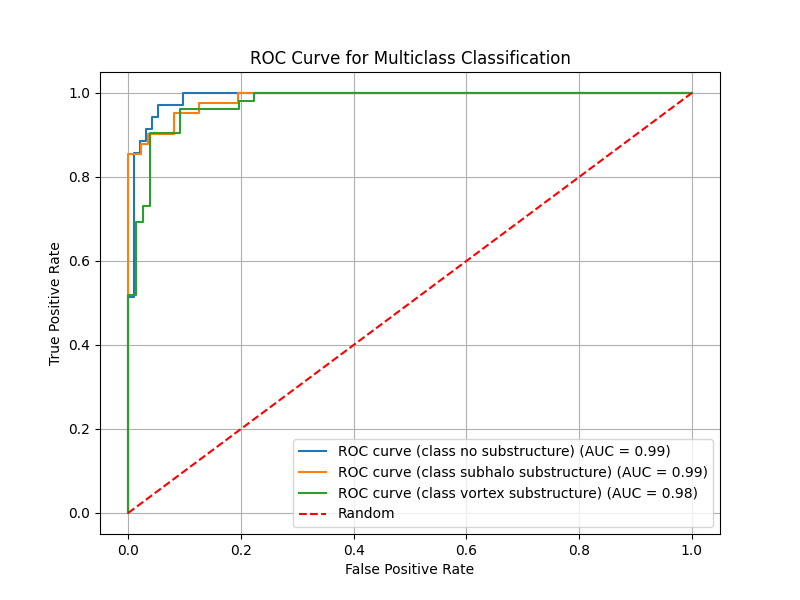

## Evaluation Test: DeepLense

### Test I.
#### [notebook](./test1/test1.ipynb) and [the best trained model weight](./test1/models/best.ckpt)

the best valid acc is 87% which is close to 90%

#### Train(if you want)

first download the dataset and unzip it to `test*` dir and then modify the `data_path` item and then
```
python train.py
```

#### ROC Curve



### Test V.

> Note!
> 
> I'm sorry, I have little understand about how to use the physical equation to the picture data
>
> But when I reproducing the Lensiformer model I find that the `loss` `went up rather than down`, and I did not figure out where does he apply the physical formula
